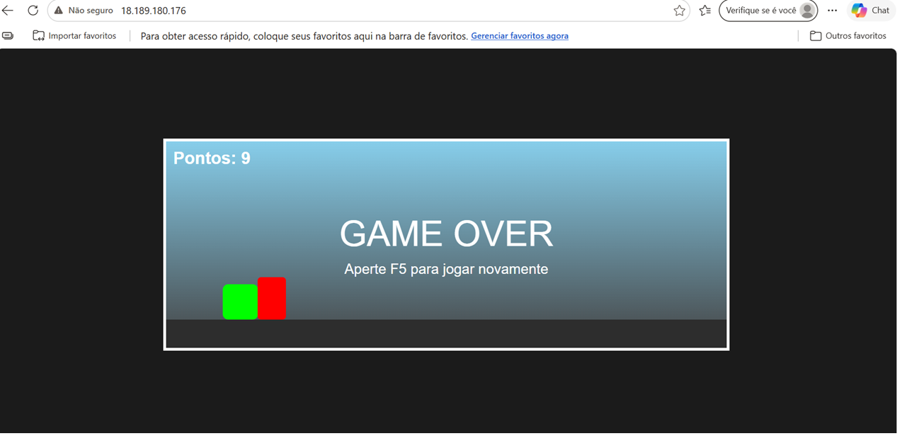
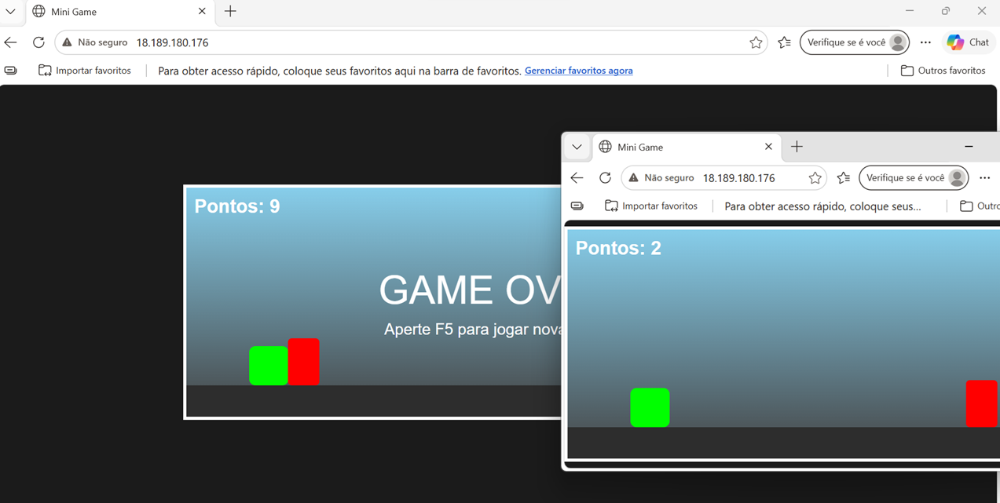
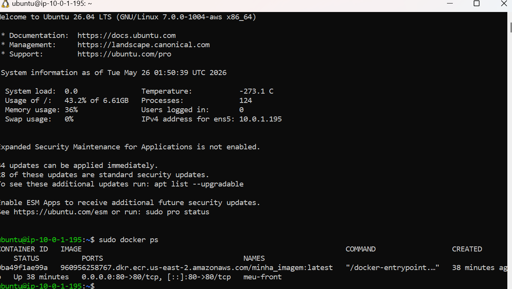
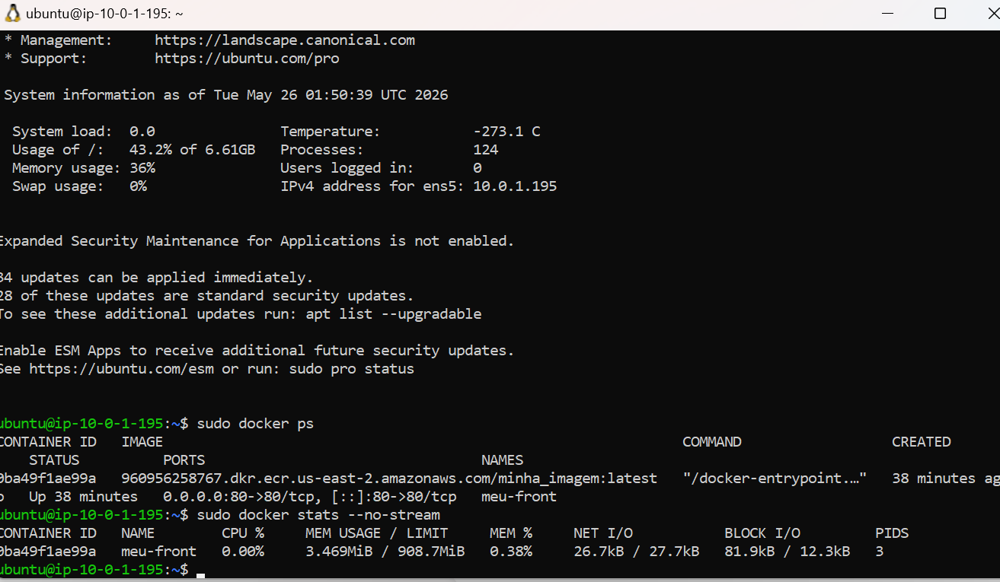
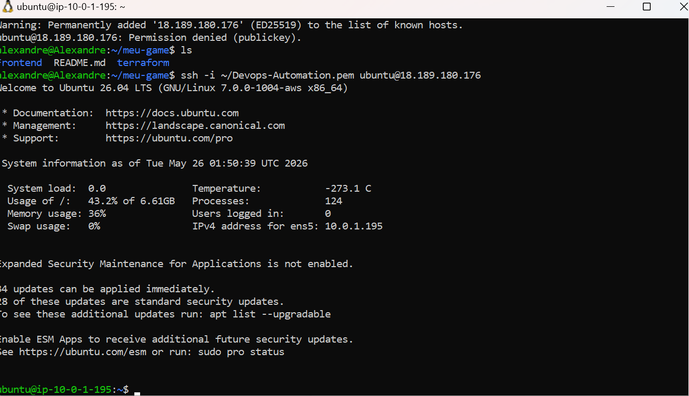

# 🎮 Infraestrutura de Mini Game com Docker, Terraform e AWS

Este projeto demonstra a criação de uma infraestrutura automatizada e resiliente na nuvem da AWS para hospedar um mini jogo em container, utilizando práticas modernas de DevOps como Infraestrutura como Código (IaC) e esteira de automação.

## 🚀 Tecnologias Utilizadas

* **Terraform:** Provisionamento automatizado de toda a infraestrutura de rede e computação.
* **Docker:** Empacotamento do mini jogo em um container leve e isolado.
* **Amazon ECR (Elastic Container Registry):** Armazenamento seguro da imagem Docker.
* **AWS EC2:** Instância Linux (Ubuntu) utilizada como servidor para rodar a aplicação.
* **GitHub Actions:** Pipeline de CI/CD para automação do build e deploy.

---

## 📸 Demonstração do Projeto

### Jogo Rodando na Nuvem (AWS)
O jogo foi implantado com sucesso e ficou totalmente acessível publicamente através do IP da instância EC2 na porta padrão HTTP (80):



### Interface e Gameplay
Tela do mini game rodando direto do navegador do usuário:



---

## 🛠️ Validação da Infraestrutura via SSH

Abaixo estão as evidências coletadas direto de dentro do servidor AWS (EC2) após o deploy automatizado:

### 1. Containers Ativos (`sudo docker ps`)
O container `meu-front` rodando de forma estável, mapeado na porta `80->80`:



### 2. Consumo de Recursos (`sudo docker stats`)
Métrica real demonstrando a alta performance e o consumo extremamente baixo de memória RAM (apenas **3.46 MiB**) pelo container do jogo:



### 3. Log de Inicialização do Sistema
Acesso SSH inicial realizado com sucesso através do ambiente WSL:



---

## ⚙️ Como Executar o Projeto

1. **Provisionar a Infraestrutura:**
   Acesse a pasta `terraform` e inicie o ambiente:
   ```bash
   cd terraform
   terraform init
   terraform apply -auto-approve
